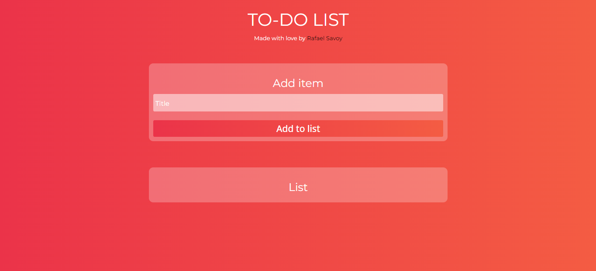

# To-Do List

## How to use

Put the item name in input, and click in the button to add item in list

## How it works

After adding the item, the code places the information in local storage to be read later

https://rafaelsavoy.github.io/to-do-list/
